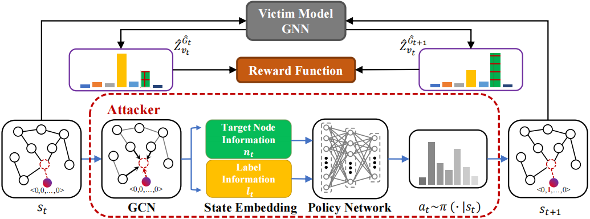

# G2-SNIA


## Introduction

This is the repository for paper: **Single-Node Injection Label Specificity Attack on Graph Neural Networks via Reinforcement Learning**. We sincerely appreciate your interest in our work!

1. To reproduce our experiments, please change the project path to your directory in default.py first. 

``````python
# change this path to your directory.
project_path = '/home/public/G2-SNIA'
``````

2. To train the agent, please run the following code:

``````shell
python3 train_ppo.py --dataset ${dataset} --model ${model} --gpu ${device_id}
``````

3. To test the performance of the agent, please run the following code:

``````shell
python3 test_agent.py --dataset ${dataset} --model ${model} --gpu ${device_id}
``````

## Requirements

+ python == 3.8.13
+ numpy == 1.23.2
+ pytorch == 1.12.1
+ tensorflow == 2.10.0
+ scipy == 1.9.0
+ yacs == 0.1.8
+ tqdm == 4.64.0

## Cite

If you would like to use our code, please cite:

``````
@ARTICLE{10499722,
  author={Chen, Dayuan and Zhang, Jian and Lv, Yuqian and Wang, Jinhuan and Ni, Hongjie and Yu, Shanqing and Wang, Zhen and Xuan, Qi},
  journal={IEEE Transactions on Computational Social Systems}, 
  title={Single-Node Injection Label Specificity Attack on Graph Neural Networks via Reinforcement Learning}, 
  year={2024},
  volume={},
  number={},
  pages={1-16},
  keywords={Closed box;Training;Cyberspace;Predictive models;Perturbation methods;Glass box;Vectors;Graph injection attack (GIA);graph neural networks (GNN);label specificity attack;reinforcement learning},
  doi={10.1109/TCSS.2024.3377554}}
``````

## Contact

Dayuan Chen(dayuanchen1998@163.com)

